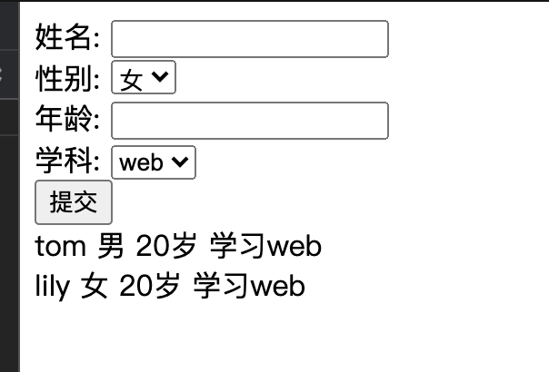

# 作业

### 根据所给的index.njk页面，完成学生的信息录入功能

```json
router.get('/student',async(ctx,next)=>{
  try {
    const students = await studentsModel.find({});
    ctx.state = {
      students
    }
    await ctx.render('student',ctx.state)
  } catch (error) {
    console.log(error);
  }
  
})
const { Schema } = mongoose;
const studentsSchema = new Schema({
  name: String,
  gender: Number,
  age: Number,
  major: String
});
const studentsModel = mongoose.model('students',studentsSchema);
router.post('/student',async(ctx,next)=>{
  try {
    const { name, gender, age, major } = ctx.request.body;
    let data = {
      name,
      gender,
      age,
      major
    }
    const studentModel = new studentsModel(data);
    await studentModel.save();
    
    ctx.response.body = data;
  } catch (error) {
    console.log(error)
  }
  
  
})
```


1. 信息包括

   ```json
    {
    	 "name":String,
      "gender":Number,
      "age":Number,
      "major":String,
    }
   ```

2. 将信息录入students collection中

3. 在njk文件，class为student-list的div中，每次刷新都能获取最新的学生们的数据，其中的for循环代码已经存在，请继续完成后续内容，完成后如下：



